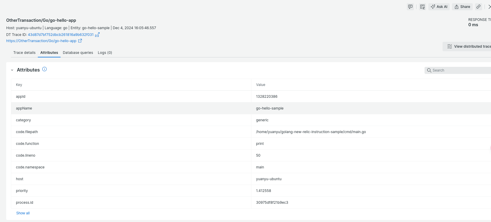

# golang-new-relic-instruction-sample

This repository is demo how to instruction golang application with new-relic agent

## steps 

1. go to new relic website and register a license key
```shell
go get github.com/newrelic/go-agent/v3/newrelic
```
2. install new relic agent on golang

## sample code

```golang
package main

import (
	"fmt"
	"os"
	"time"

	"github.com/leetcode-golang-classroom/golang-new-relic-instruction-sample/internal/config"
	"github.com/newrelic/go-agent/v3/newrelic"
)

var (
	// Making app and err a global variable
	nrApp *newrelic.Application
	nrErr error
)

func main() {
	nrApp, nrErr = newrelic.NewApplication(

		// Workshop > Set the values in the newrelic.Config struct from within a custom newrelic.ConfigOption
		// https://docs.newrelic.com/docs/apm/agents/go-agent/configuration/go-agent-configuration/

		// Workshop > Name your application
		newrelic.ConfigAppName(config.AppConfig.AppName),
		// Workshop > Fill in your New Relic Ingest license key
		newrelic.ConfigLicense(config.AppConfig.NewRelicLicenseKey),
		// Workshop > Add debug logging for extra details
		newrelic.ConfigDebugLogger(os.Stdout),
	)

	// If an application could not be created then err will reveal why.
	if nrErr != nil {
		fmt.Println("unable to start NR instrumentation - ", nrErr)
	}
	// Not necessary for monitoring a production application with a lot of data.
	nrApp.WaitForConnection(5 * time.Second)

	// Run a simple function
	print()

	// Wait for shut down to ensure data gets flushed
	nrApp.Shutdown(5 * time.Second)
}

func print() {
	// Workshop > Monitor a Golang transaction
	// https://docs.newrelic.com/docs/apm/agents/go-agent/instrumentation/instrument-go-transactions/#go-txn
	// Put your code here
	txn := nrApp.StartTransaction("go-hello-app")
	defer txn.End()
	fmt.Println("Hello world! Welcome to your first instrumented Golang App!")
}

```

透過 StartTransaction 來針對要執行的 print 作 profile

當使用 ./gg lauch 啟動之後

透過 new relic 後台的 APM 內部的 Transaction 的屬性 
可以看到如下圖:


Transaction 的狀況

以及細節如下圖

